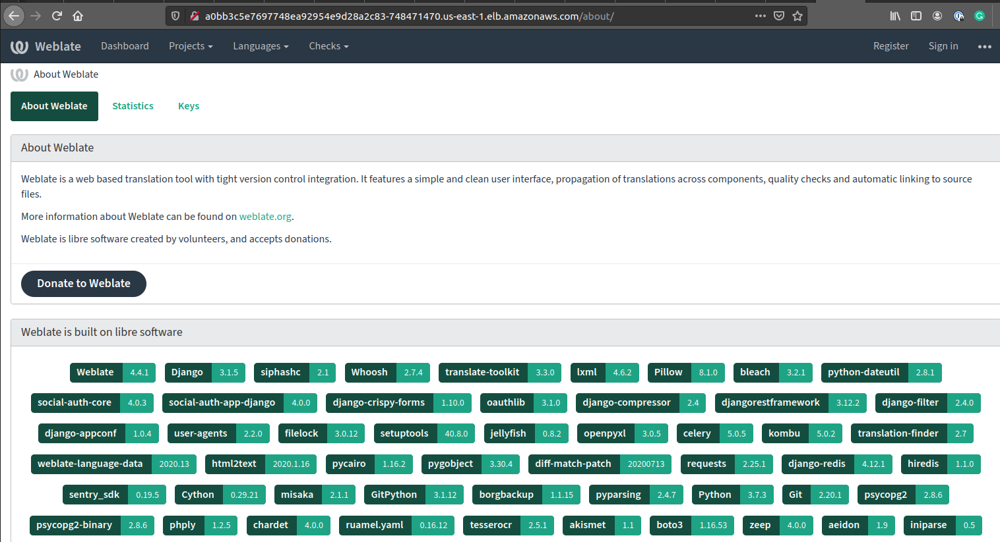
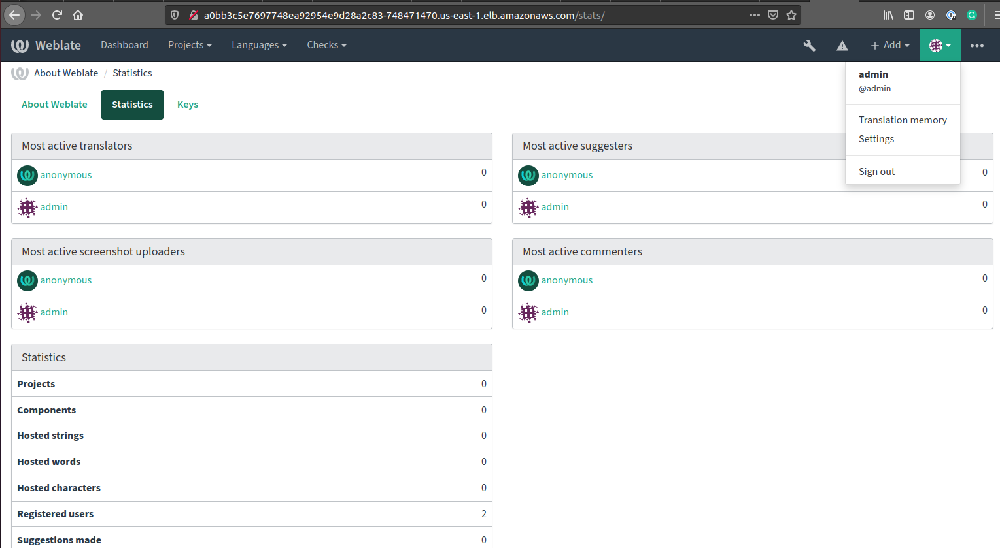

# AWS-EKS-WEBLATE

Simple test launchpad for Weblate https://github.com/WeblateOrg/weblate <br />
AWS + EKS + helm

## requirements

Install and configure AWS CLI, kubectl, helm & Terraform v 0.14+: <br />
https://docs.aws.amazon.com/cli/latest/userguide/install-cliv2.html <br />
https://kubernetes.io/docs/tasks/tools/install-kubectl/ <br />
https://helm.sh/docs/intro/install/ <br />
https://learn.hashicorp.com/tutorials/terraform/install-cli

## features

1. Used Terraform community modules https://registry.terraform.io/
2. AWS services for BD & Redis
3. Safe networks (public + private + NAT + SG) & IAM configuration
4. Build in rolling update (possible to configure as pure blue/green) with EKS & Helm
5. Horizontal app autoscaling
6. Used Terraform remote state backend with encrypted s3 bucket
7. Terraform remote state lock AW DynamoDB table

## Roll-out 
run:
```bash
cd prepare-s3-backend
terraform init
terraform apply

cd ..

cd us-east-1
terraform init
terraform apply
```
example output:
```bash
weblate-admin-email = "weblate@admin.com"
weblate-admin-password = "phNcvqRPENHgRueq" #generated at first rollout

null_resource.get-service (local-exec): NAME         TYPE           CLUSTER-IP      EXTERNAL-IP                                                              PORT(S)        AGE
null_resource.get-service (local-exec): kubernetes   ClusterIP      10.100.0.1      <none>                                                                   443/TCP        6h38m
null_resource.get-service (local-exec): weblate      LoadBalancer   10.100.102.95   a0bb3c5e7697748ea92954e9d28a2c83-748471470.us-east-1.elb.amazonaws.com   80:30547/TCP   6m19s

```
## Remove 
run:
```bash
terraform destroy
```

## Access to the app
Use LoadBalancer DNS name to access to Weblate a0bb3c5e7697748ea92954e9d28a2c83-748471470.us-east-1.elb.amazonaws.com



Use received credentials to login to Weblate as admin



### Horizontal pods scaling implementation
```bash
kubectl get hpa
NAME      REFERENCE            TARGETS   MINPODS   MAXPODS   REPLICAS   AGE
weblate   Deployment/weblate   6%/30%    1         3         1          5m26s

```
With test load
```bash
kubectl get hpa
NAME      REFERENCE            TARGETS    MINPODS   MAXPODS   REPLICAS   AGE
weblate   Deployment/weblate   105%/30%   1         3         3          20m

```
### todos
1. Store secrets in AWS SM Parameter Store
2. Add https termination with Load Balancer
3. Split Weblate Docker container into smaller pieces instead of using official image